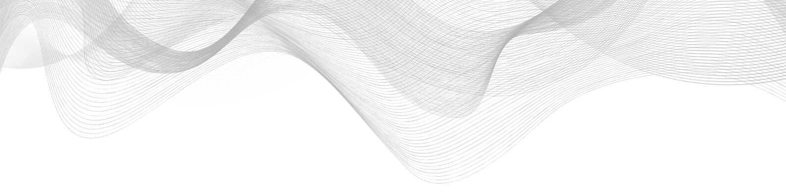
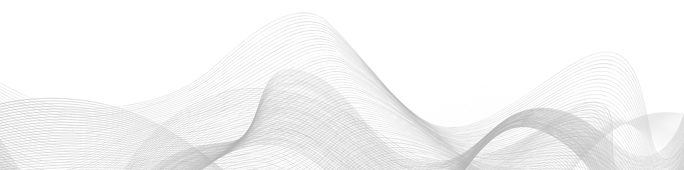

    </a>

# Hello, I'm Guylann Bresson

  
  
  

---

### About Me
Passionné d'informatique depuis mon plus jeune âge, je me concentre sur le **développement pratique, la résolution de problèmes et la recherche**. J'aime explorer comment simplifier des systèmes complexes tout en créant des outils innovants.

* **Étudiant en Informatique** | Autodidacte & Chercheur indépendant.
* Focus actuel : **IA distribuée, systèmes asynchrones et langages minimaux.**

---

### Research Focus
#### **IA Atomique — Atomic AI Inference Engine**
> *Intelligence émergente issue d'interactions locales entre atomes computationnels.*
> **Preprint & Paper:** [Consulter sur Zenodo](https://zenodo.org/records/18487035)

- **Concept :** Moteur d'IA distribué et asynchrone inspiré par la résonance atomique.
- **Impact :** Auto-organisation, résilience et basse consommation.
- **Applications :** Smart cities, robotique collaborative, IoT Industriel.

 

---

### Featured Projects

| Project | Description | Tech Stack |
| :--- | :--- | :--- |
| **Bresson Script (BRS)** | Langage interprété minimaliste axé sur la lisibilité et l'efficacité. | `Go` / `Interpreter` |
| **Nova AI** | Assistant vocal local capable de généraliser les intentions utilisateurs. | `Python` / `LLMs` |
| **Galactic Blast** | Générateur d'images textuelles haute qualité avec effets de lueur. | `Web Tech` |

---

### Skills & Stack

- **Languages:**   
- **AI & Tools:** `Local LLMs`, `MicroPython`, `REST APIs`, `LM Studio`
- **Core Concepts:** AI Agents, Distributed Systems, Asynchronous Computation, Emergent Behavior

---

### GitHub Stats

    </a>

